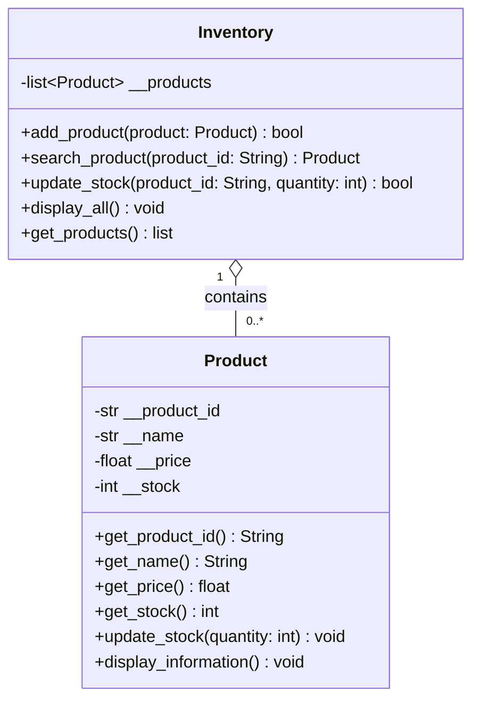

# Week 8 UML Class Diagram

```mermaid
classDiagram
    class Product {
        -str __product_id
        -str __name
        -float __price
        -int __stock
        +get_product_id() String
        +get_name() String
        +get_price() float
        +get_stock() int
        +update_stock(quantity: int) void
        +display_information() void
    }

    class Inventory {
        -list~Product~ __products
        +add_product(product: Product) bool
        +search_product(product_id: String) Product
        +update_stock(product_id: String, quantity: int) bool
        +display_all() void
        +get_products() list
    }

    Inventory "1" o-- "0..*" Product : contains
```

The main program creates and uses the `Inventory` and `Product` objects. JSON loading and saving remain in separate functions in `main.py`.
